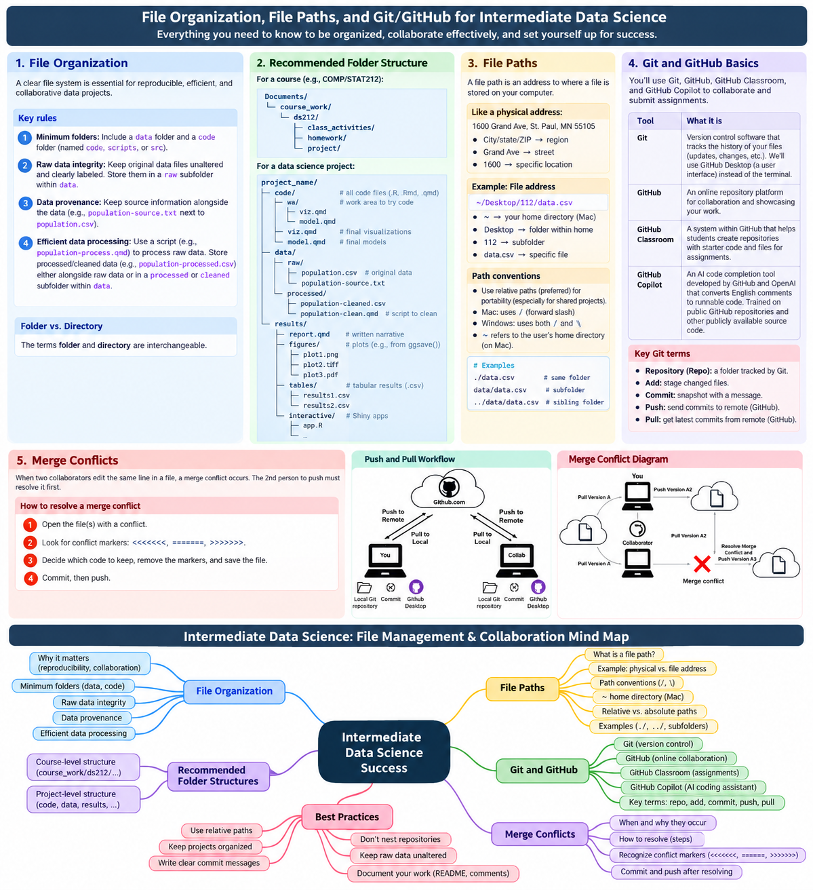
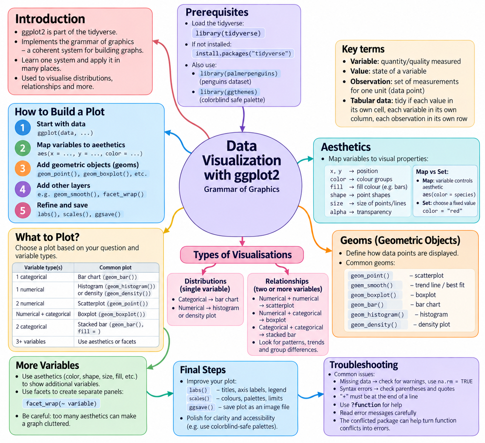
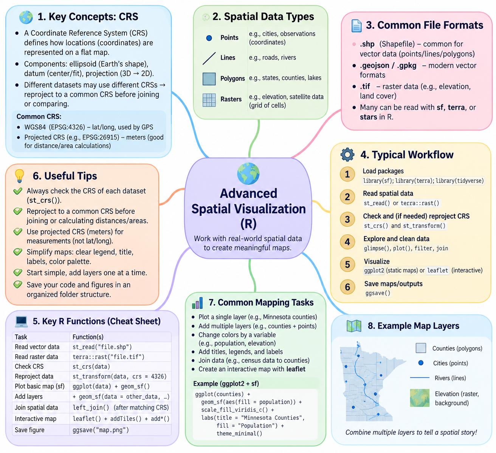

## General Workflow for a Given Dataset

What data do I have?

↓ What question do I want to ask?

↓ Which variable(s) answer my question?

↓ Do I need to summarize the data?

↓ Which graph communicates the answer?

## R

## Quarto

## File Systems

## Advanced Data Viz

## Advanced Spatial Viz

